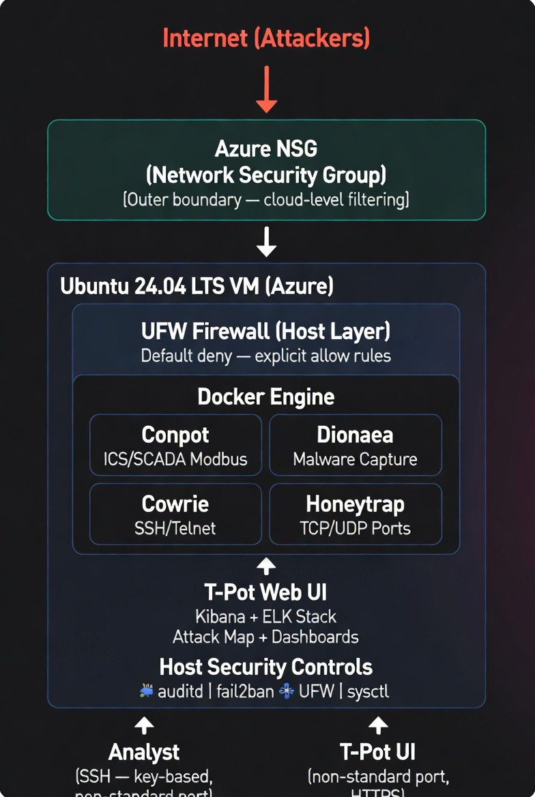
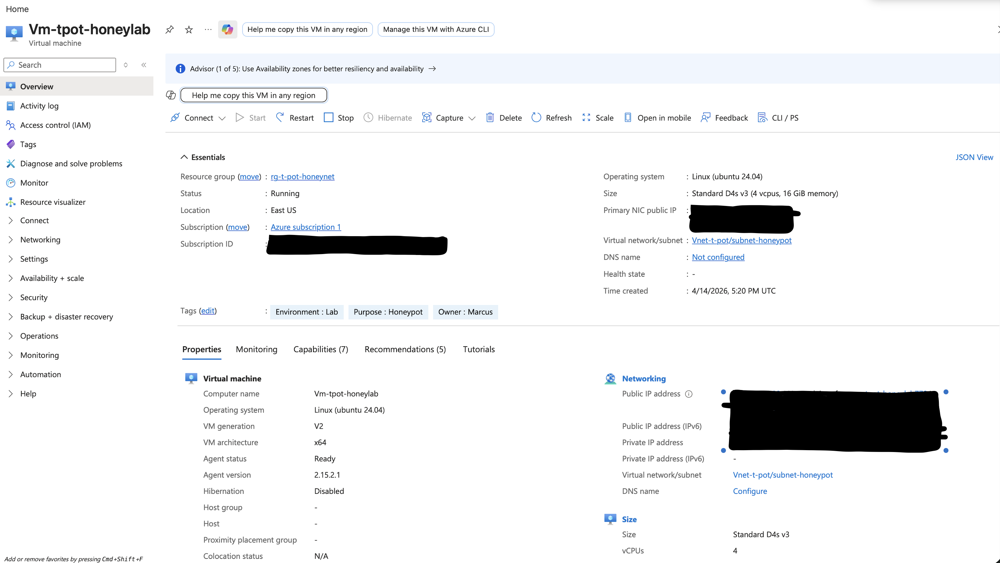
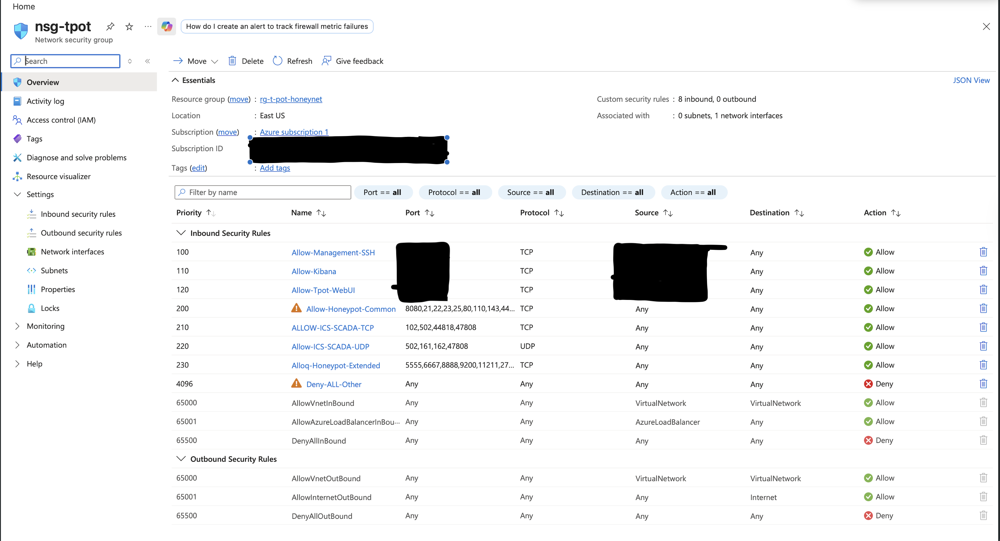
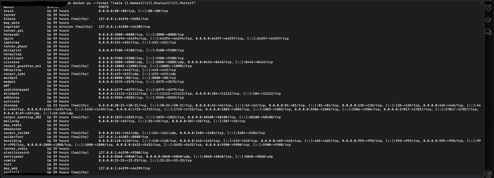
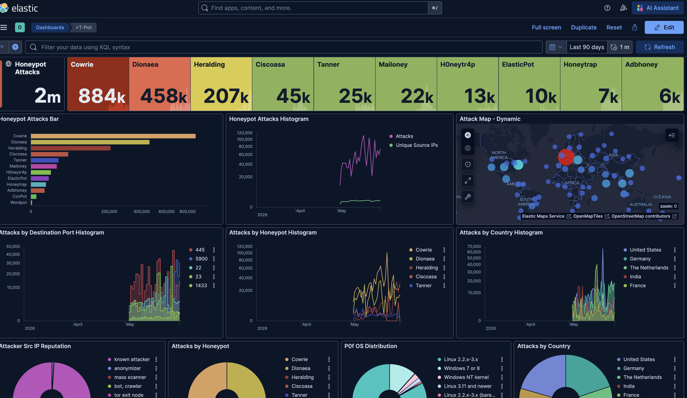
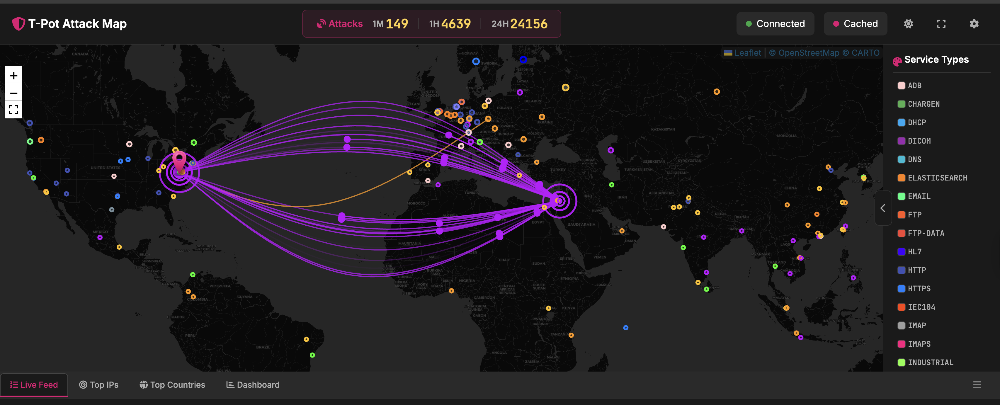
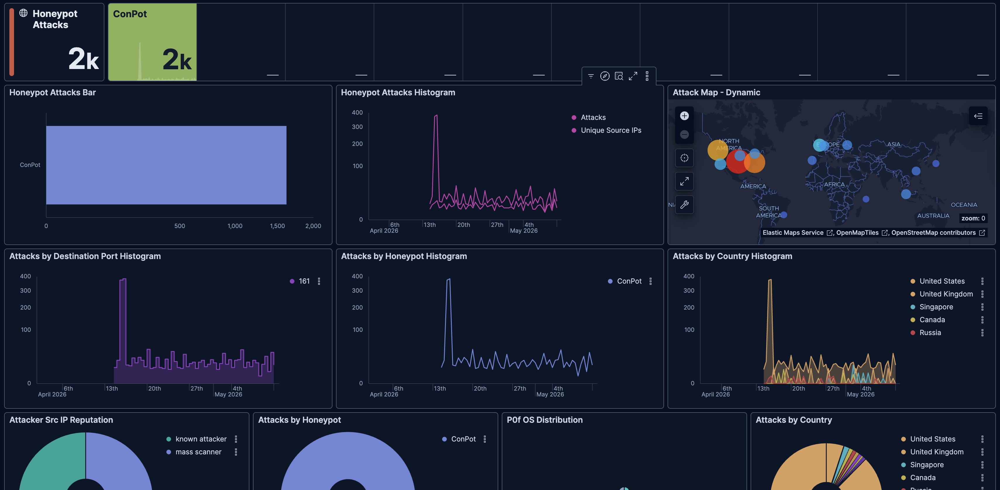

# 🍯 T-Pot Honeypot Lab — Azure Deployment

> **A multi-honeypot platform deployed on Microsoft Azure, capturing real-world attack telemetry across common and ICS/SCADA protocols, with host-level security hardening mapped to NIST SP 800-53 Rev. 5.**

---

## 📋 Table of Contents

- [Project Overview](#project-overview)
- [Architecture](#architecture)
- [Deployment Environment](#deployment-environment)
- [Honeypot Sensors](#honeypot-sensors)
- [Deployment Steps](#deployment-steps)
- [Live Attack Telemetry](#live-attack-telemetry)
- [Security Hardening](#security-hardening)
- [Repository Structure](#repository-structure)
- [Key Takeaways](#key-takeaways)

---

## Project Overview

This project deploys [T-Pot](https://github.com/telekom-security/tpotce) — a multi-honeypot platform developed by Deutsche Telekom Security — on a Microsoft Azure virtual machine exposed to the public internet. The honeypot captures and analyzes real attack traffic from threat actors targeting common services and industrial control system (ICS/SCADA) protocols.

The deployment also serves as a host hardening case study, demonstrating how to apply NIST SP 800-53 Rev. 5 controls to a container-heavy server where automated compliance scanning tools are unable to evaluate the environment.

**What this project demonstrates:**
- Cloud-based honeypot deployment and management
- ICS/OT threat intelligence collection via Conpot (Modbus, S7, BACnet, IEC-104)
- Host hardening methodology on Docker-based infrastructure
- Real-world gap between automated compliance scanning and manual control verification
- Evidence-based security documentation with accepted risk statements

---

## Architecture

*T-Pot honeypot lab architecture — Azure VM, Docker containers, and host security controls*

---

## Deployment Environment


*Azure VM overview — Ubuntu 24.04 LTS, Standard D4s v3, East US, Status: Running*

| Component | Details |
|---|---|
| **Cloud Provider** | Microsoft Azure |
| **VM Size** | Standard_D4s_v3 (4 vCPU, 16GB RAM) |
| **OS** | Ubuntu 24.04.4 LTS (Noble Numbat) |
| **Kernel** | 6.17.0-1015-azure |
| **T-Pot Version** | 24.x (Docker-based) |
| **Disk** | 247GB managed disk |
| **SSH** | Key-based authentication, non-standard port |
| **Management UI** | HTTPS, non-standard port |

---

## Honeypot Sensors

T-Pot runs multiple honeypot containers simultaneously, each emulating a different service or protocol to attract specific attacker behaviors.

| Sensor | Protocol / Service | Purpose |
|---|---|---|
| **Conpot** | Modbus, S7, BACnet, IEC-104 | ICS/SCADA attack emulation |
| **Cowrie** | SSH, Telnet | Credential brute force and shell interaction capture |
| **Dionaea** | SMB, HTTP, FTP, MSSQL | Malware sample collection |
| **Honeytrap** | TCP/UDP (any port) | General port scan and connection capture |
| **Heralding** | Multi-protocol | Credential capture across services |
| **Mailoney** | SMTP | Email-based attack capture |
| **Ciscoasa** | Cisco ASA emulation | Network device targeting |
| **Tanner** | HTTP | Web application attack capture |

> **ICS/OT Focus:** Conpot is the primary sensor of interest for this project. It emulates Siemens S7 PLCs and Modbus devices, capturing reconnaissance and exploitation attempts against industrial protocols — traffic that would be catastrophic if directed at real OT infrastructure.

---

## Deployment Steps

### 1. Create the Azure VM

Recommended configuration:
- **Image:** Ubuntu 24.04 LTS
- **Size:** Standard_D4s_v3 or larger (T-Pot requires ≥8GB RAM, 128GB disk)
- **Authentication:** SSH public key only — disable password auth
- **Inbound ports:** Allow SSH on a non-standard port at creation; all other ports opened after T-Pot install

### 2. Configure Azure NSG (Network Security Group)

The NSG acts as the outer firewall layer before traffic reaches the VM.


*Azure NSG inbound rules — management access restricted by source IP; honeypot and ICS/SCADA ports open to any*

Rules configured:
- **Priority 100–120** — Management access (SSH, Kibana, Web UI) locked to analyst source IP only
- **Priority 200** — Common honeypot ports open to any (intentional)
- **Priority 210–220** — ICS/SCADA TCP and UDP ports open to any
- **Priority 230** — Extended honeypot ports open to any
- **Priority 4096** — Explicit deny-all catch rule

### 3. Install T-Pot

SSH into the VM and run the T-Pot installer:

```bash
# Update system first
sudo apt update && sudo apt upgrade -y

# Clone T-Pot repository
git clone https://github.com/telekom-security/tpotce
cd tpotce

# Run installer
sudo ./install.sh
```

The installer will:
- Install Docker and Docker Compose
- Pull all honeypot container images (~20+ containers)
- Configure the ELK stack (Elasticsearch, Logstash, Kibana)
- Set up the T-Pot web UI
- Reboot the VM automatically when complete

> *Installation logs were not captured at time of deployment. All containers verified running post-install — see Step 4.*

### 4. Verify T-Pot is Running

After the VM reboots, SSH back in and verify all containers are up:

```bash
sudo docker ps --format "table {{.Names}}\t{{.Status}}\t{{.Ports}}"
```


*All T-Pot containers running — 30+ honeypot sensors active, all showing "Up 39 hours" status*

### 5. Access the T-Pot Web UI

Navigate to your T-Pot UI URL in your browser to access the Kibana dashboards and attack map.


*T-Pot Kibana dashboard — 2 million total attacks captured over 90 days across all sensors*

---

## Live Attack Telemetry

Within hours of deployment, T-Pot begins capturing real attack traffic. The ELK stack aggregates and visualizes this data across all honeypot sensors.

### Attack Map


*T-Pot live attack map — 24,156 attacks in 24 hours, 4,639 in the last hour. Service types include INDUSTRIAL and IEC104 (industrial protocol) indicating active ICS/SCADA targeting*

### Full Dashboard — All Sensors


*90-day dashboard — 2M total attacks. Top sensors: Cowrie 884k (SSH brute force), Dionaea 458k (malware), Heralding 207k (credential capture). Conpot ICS sensor visible in bar chart*

### Conpot ICS/SCADA Telemetry

Conpot specifically captures attacks targeting industrial protocols. The data below reflects real connection attempts to the emulated ICS environment.


*Conpot dashboard — 2k ICS/SCADA-targeted attacks. Source countries: United States, United Kingdom, Singapore, Canada, Russia. Attacker IP reputation: mix of known attackers and mass scanners*

**Why this matters for OT security:**
- These are real probes targeting Modbus, S7 Comm, BACnet, and IEC-104 — the same protocols running in energy, water, and manufacturing facilities
- The geographic spread indicates both nation-state adjacent scanning infrastructure and commodity threat actors
- A real ICS device receiving this traffic would have no visibility into it without dedicated OT network monitoring

---

## Security Hardening

The VM was hardened after deployment using manual control verification mapped to **NIST SP 800-53 Rev. 5**. Automated compliance scanning via OpenSCAP was attempted but returned all `notapplicable` results due to Docker's containerized architecture — a documented tooling limitation addressed through manual verification.

**34 controls verified across 5 domains. 33/34 passing or remediated (97%).**

| Domain | Controls | Result |
|---|---|---|
| Kernel & Network Hardening | 9 | 8 pass, 1 remediated |
| Authentication & Account Policy | 6 | 3 pass, 3 remediated |
| Audit & Logging | 8 | 8 pass |
| Firewall & Services | 6 | 2 pass, 4 remediated |
| File Permissions & SUID | 5 | 5 pass |

**Key remediations applied:**
- `send_redirects` disabled via sysctl.d
- Password aging set to 90-day maximum
- PAM faillock configured — account lockout after 5 failed attempts, 15-minute lockout
- auditd installed with custom rules monitoring identity, privilege, and network changes
- UFW enabled with default deny — explicit rules for management and honeypot traffic
- fail2ban installed with active sshd jail

📄 **Full hardening documentation with all commands, findings, and accepted risk statements:**
👉 [`hardening/HARDENING.md`](hardening/HARDENING.md)

---

## Repository Structure

```
tpot-honeypot-azure/
├── README.md                              ← This file
├── POAM.md                                ← POA&M documentation
├── hardening/
│   └── HARDENING.md                       ← Full NIST SP 800-53 hardening report
├── docs/
│   └── FedRAMP-POAM-TpotHoneypot.xlsx    ← FedRAMP POA&M template
└── screenshots/
    ├── 01-azure-vm-overview.png
    ├── 02-azure-nsg-rules.png
    ├── 04-docker-containers.png
    ├── 05-tpot-webui.png
    ├── 06-attack-map.png
    ├── 07-kibana-dashboard.png
    └── 08-conpot-telemetry.png
```

---

## Key Takeaways

1. **ICS/SCADA protocols are actively targeted on the public internet** — Conpot began receiving Modbus and S7 connection attempts within hours. This is real threat actor behavior, not simulated traffic.

2. **Automated scanners have real limits in containerized environments** — OpenSCAP returned 387 `notapplicable` results. The correct response is to recognize the tooling gap and pivot to manual verification, not to accept a misleading score.

3. **Hardening a honeypot requires different judgment than hardening a production server** — the goal is controlled, monitored exposure. Some CIS findings are accepted by design and documented with compensating controls.

4. **Layered security matters even on intentionally exposed systems** — UFW, fail2ban, auditd, and PAM faillock protect the host OS and management plane even while the honeypot surface remains open.

5. **Firewall rule ordering on remote servers is unforgiving** — always allow your management port before enabling a default-deny firewall policy.

---

*Built by [@marcusheymann](https://www.linkedin.com/in/mheymann1) | OT/ICS Cybersecurity Analyst*
*Tools: T-Pot · Azure · Docker · OpenSCAP · auditd · UFW · fail2ban · ELK Stack*
*Framework: NIST SP 800-53 Rev. 5*
